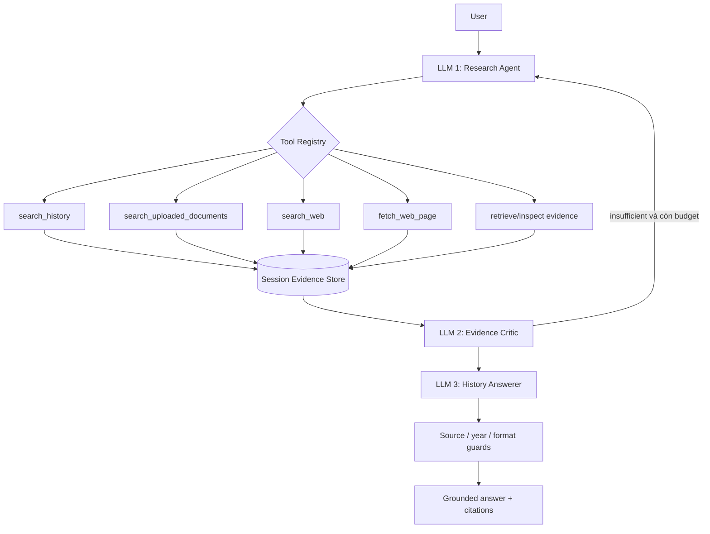

<div align="center">

# 🏯 Vietnamese History Agentic RAG

**Hybrid RAG · 3 LLM · Central Qwen3-8B · FastAPI · React · Modal**


[🚀 Chạy nhanh](#-chạy-local) · [🧠 Train 3 LLM](#-train-ba-llm) · [☁️ Modal](#️-đưa-artifact-lên-modal-volume) · [🧪 Kiểm thử](#-kiểm-thử) · [🧯 Xử lý lỗi](#-xử-lý-lỗi)

</div>

> [!IMPORTANT]
> Git không chứa model weights, corpus deployment 58.603 chunks, FAISS hoặc BM25S index. `APP_MODE=api-only` chạy không cần artifact. `retrieval-only` và `full` cần build/export hoặc lấy artifact từ nơi lưu trữ của dự án.

## ✨ Tổng quan

Hệ thống có ba mode user-facing tách biệt:

1. **`hybrid`**: hybrid retrieval rồi một History Answerer tạo câu trả lời.
2. **`three_llm`**: pipeline Research → Evidence → History dùng shared Qwen3-4B và ba adapter vai trò.
3. **`central`**: một Qwen3-8B + Central adapter tự chọn công cụ, đọc observation và tự viết final answer.

Pipeline `three_llm` giữ ba vai trò:

1. **Research / Tool Agent** dùng Qwen3 và tool registry để tìm local corpus, tài liệu PDF/ảnh đã upload trong conversation, tìm web khi được cấu hình, đọc trang và truy vấn evidence trong session.
2. **Evidence Critic / Compressor** dùng adapter Qwen3 riêng để lọc, phát hiện xung đột, nén evidence và chỉ được chọn ID đã tồn tại.
3. **History Answerer** dùng adapter Qwen3 riêng, được fresh grounded RAG-SFT, để sinh câu trả lời tiếng Việt có citation rồi chạy source/year/format guards.

Ba adapter `research`, `evidence`, `history` dùng chung đúng một frozen Qwen3-4B base trong shared runtime, nhưng giữ dataset, schema, evaluator, prompt và adapter độc lập. Qwen2.5 History cũ chỉ là legacy benchmark baseline.

## 🧭 Kiến trúc



Giới hạn mặc định: 6 agent steps, 3 web searches, 5 page fetches và tối đa một research retry sau critic. Evidence web chỉ nằm trong session, không tự ghi vào corpus lịch sử lâu dài.

Central không gọi hoặc load Research, Evidence hay History adapter. Runtime 4B và 8B được lazy-load độc lập theo mode.

## 🗂️ Cấu trúc repository

```text
Chatbot_answering_vietnamese_history/
├── app/                         # FastAPI, RAG runtime, agents, tools, memory
│   ├── agents/                  # 3-role runtime + standalone Central 8B runtime
│   ├── tools/                   # Registry, local/web/fetch/evidence tools
│   ├── rag/                     # E5 + FAISS + BM25S + RRF + reranker + generation
│   ├── api/                     # Chat, SSE, retrieve, conversation endpoints
│   └── chat/                    # SQLite memory, PDF/OCR temporary corpus
├── training/                    # Toàn bộ workflow train Python, không dùng notebook
│   ├── common/                  # CLI, QLoRA, split, JSONL, Trainer logging
│   ├── history_answerer/        # Instruction SFT + Phase 6 RAG-SFT + eval/merge
│   ├── research_agent/          # Trajectory prep + Qwen3 QLoRA + eval
│   ├── evidence_agent/          # Evidence dataset + Qwen3 QLoRA + eval
│   ├── trajectory_dataset/      # Future central Qwen3-8B behavioral trajectories
│   └── scripts/                 # Corpus, index, benchmark, merge, export
├── scripts/                     # Modal Volume upload CLI
├── artifacts/                   # Contract artifact; weights/index thật bị gitignore
├── Dataset/                     # 1.000 RAG-SFT messages
├── frontend/                    # React 19 + Vite chat UI
├── tests/                       # Offline unit/smoke tests, không tải model lớn
├── modal_app.py                 # Modal ASGI app, GPU A100, persistent Volumes
├── requirements.txt             # Runtime dependencies
└── requirements-training.txt    # Training/evaluation dependencies
```

README chuyên sâu: [backend](app/README.md), [agents](app/agents/README.md), [tools](app/tools/README.md), [training](training/README.md), [artifacts](artifacts/README.md), [datasets](Dataset/README.md), [frontend](frontend/README.md), [scripts](scripts/README.md), [tests](tests/README.md).

## 🔧 Cài đặt

### Runtime local

Windows PowerShell:

```powershell
python -m venv .venv
.\.venv\Scripts\Activate.ps1
python -m pip install --upgrade pip
python -m pip install -r requirements.txt
Copy-Item .env.example .env
```

Linux/macOS:

```bash
python3 -m venv .venv
source .venv/bin/activate
python -m pip install --upgrade pip
python -m pip install -r requirements.txt
cp .env.example .env
```

### Training environment

```bash
python -m pip install -r requirements-training.txt
```

Không cần Jupyter hoặc `ipykernel`. Toàn bộ entry point là Python CLI.

## 🧩 Qwen3-8B Central Agent Training Pipeline

Pipeline ở [`training/trajectory_dataset/`](training/trajectory_dataset/) tạo training trajectory cho Central Qwen3-8B: chọn tool, truy vấn RAG, đọc observation, tìm lại khi thiếu bằng chứng và trả lời tiếng Việt có citation. Adapter đã được tích hợp vào runtime `central`; corpus hiện hữu vẫn là knowledge và không bị QLoRA sửa đổi.

Hướng dẫn đầy đủ: [`training/trajectory_dataset/README.md`](training/trajectory_dataset/README.md). CLI chính:

```powershell
python -m training.trajectory_dataset.cli --help
python -m training.trajectory_dataset.cli build-custom `
  --corpus-path artifacts/vn_history_deployment/corpus `
  --output-dir D:/vn-history/trajectory_dataset_v1 `
  --retrieval-backend project `
  --dry-run
```

Ví dụ Colab/Drive (đường dẫn chỉ là mẫu):

```bash
python -m training.trajectory_dataset.cli build-all \
  --mount-drive \
  --corpus-path /content/drive/MyDrive/vn-history/artifacts/vn_history_deployment/corpus \
  --output-dir /content/drive/MyDrive/vn-history/trajectory_dataset_v1 \
  --max-samples-per-source 2000 \
  --resume \
  --dry-run
```

Script train QLoRA Python-only là `training/train_qwen3_8b_agent.py`; hãy chạy `--dry-run` trước. Không có notebook, không tự mount Drive, không tự tải toàn bộ public dataset và không tự chạy training.

## 🚀 Chạy local

### API-only, không cần model

Đặt trong `.env`:

```dotenv
APP_MODE=api-only
DEVICE=cpu
```

Chạy:

```bash
uvicorn app.main:app --host 0.0.0.0 --port 8000 --reload
```

Mở `http://127.0.0.1:8000/docs` và `http://127.0.0.1:8000/health`.

### Retrieval-only

```dotenv
APP_MODE=retrieval-only
ARTIFACT_ROOT=./artifacts/vn_history_deployment
DEVICE=cpu
```

Runtime cần corpus, config, manifest, FAISS và BM25S đúng layout ở phần artifact.

### Full 3-LLM local

```dotenv
APP_MODE=full
DEVICE=cuda
DTYPE=bfloat16
ARTIFACT_ROOT=./artifacts/vn_history_deployment
LLM_BACKEND=transformers
SHARED_BASE_MODEL_ID=Qwen/Qwen3-4B-Instruct-2507
RESEARCH_AGENT_MODEL=Qwen/Qwen3-4B-Instruct-2507
RESEARCH_AGENT_ADAPTER_PATH=./artifacts/vn_history_deployment/adapters/research
EVIDENCE_AGENT_MODEL=Qwen/Qwen3-4B-Instruct-2507
EVIDENCE_AGENT_ADAPTER_PATH=./artifacts/vn_history_deployment/adapters/evidence
HISTORY_AGENT_ADAPTER_PATH=./artifacts/vn_history_deployment/adapters/history
WEB_SEARCH_PROVIDER=local-only
```

Chạy `uvicorn` như trên. Full mode cần GPU tương thích bitsandbytes; CPU không phù hợp để phục vụ ba model.

Để khởi động deployment chỉ có Central (không cần ba adapter role 4B), dùng:

```dotenv
APP_MODE=full
DEVICE=cuda
LLM_BACKEND=transformers
ENABLE_HYBRID_MODE=false
ENABLE_THREE_LLM_MODE=false
ENABLE_CENTRAL_MODE=true
CENTRAL_AGENT_MODEL_ID=Qwen/Qwen3-8B
CENTRAL_AGENT_ADAPTER_PATH=./artifacts/vn_history_deployment/adapters/central
RUNTIME_LOADING_STRATEGY=lazy
DEFAULT_INFERENCE_MODE=central
```

Central adapter phải khai báo `base_model_name_or_path=Qwen/Qwen3-8B`; runtime từ chối adapter role 4B và không fallback sang `three_llm` khi Central không sẵn sàng.

### Frontend

```bash
npm install
npm --prefix frontend install
```

Đặt `VITE_API_BASE_URL=http://127.0.0.1:8000` trong `frontend/.env`, rồi chạy:

```bash
npm run frontend:dev
```

Giao diện ở `http://localhost:5173`.

## 🧠 Train ba LLM

Tất cả lệnh dưới đây chạy tại repository root. Luôn chạy `--help` và một dry-run trước khi dùng GPU.

### 1. History Answerer: fresh grounded QLoRA trực tiếp từ vanilla Qwen3

```bash
python -m training.history_answerer.prepare_dataset
python -m training.history_answerer.preflight
python -m training.history_answerer.train \
  --model-id Qwen/Qwen3-4B-Instruct-2507 \
  --dataset datasets/history_answerer/train.jsonl \
  --dataset-chunks training/Dataset/merged_jsonl/all_chunk_id.jsonl \
  --batch-size 1 \
  --gradient-accumulation-steps 16 \
  --epochs 3 \
  --output-dir outputs/history-answerer-full
```

Flow mới:

```text
Qwen3-4B-Instruct-2507 vanilla
  → load 4-bit NF4
  → prepare_model_for_kbit_training()
  → fresh LoRA
  → grounded RAG-SFT
```

Phase 6 không phụ thuộc hoặc merge adapter Phase 1. Target assistant luôn được giữ trọn; context bị cắt từ trái, zero-supervised bị fail. Dòng `Nguồn được dùng:` có weight 1.6 và answer body có weight 1.0.

### 2. Instruction SFT Phase 1 cũ, chỉ dùng khi cần tái hiện legacy

```bash
python -m training.history_answerer.train_instruction_sft \
  --dataset Dataset/merged_jsonl/all_messages.jsonl \
  --model-id Qwen/Qwen2.5-3B-Instruct \
  --batch-size 1 \
  --gradient-accumulation-steps 16 \
  --epochs 1 \
  --output-dir outputs/history_answerer/phase1_legacy
```

Output này không được `training.history_answerer.train` sử dụng trong flow hiện tại.

### 3. Research / Tool Agent

Research Agent chỉ chọn tools/actions và dừng; nó không sinh final history answer. Tạo grounded, unrolled history trajectories:

```bash
python -m training.research_agent.build_history_trajectories \
  --input Dataset/merged_jsonl/all_messages.jsonl \
  --output datasets/research_agent/history_trajectories.jsonl
```

Convert xLAM (generic function calling) hoặc selected AgentInstruct OS trajectories bằng schema riêng:

```bash
python -m training.research_agent.prepare_dataset \
  --source xlam \
  --output datasets/research_agent/xlam.jsonl

python -m training.research_agent.prepare_dataset \
  --source agentinstruct --split os \
  --output datasets/research_agent/agentinstruct_os.jsonl
```

xLAM yêu cầu accept dataset terms và Hugging Face login. AgentInstruct environment không map chắc chắn sẽ bị skip/report thay vì tạo tool call giả. VN History dạy domain retrieval policy; false-premise vẫn retrieval, còn no-tool dùng greeting/meta examples thật.

Pre-training validation bắt buộc:

```bash
python -m training.research_agent.validate_dataset \
  --dataset datasets/research_agent/history_trajectories.jsonl

python -m training.research_agent.preflight \
  --dataset datasets/research_agent/history_trajectories.jsonl

python -m training.research_agent.train \
  --dataset datasets/research_agent/history_trajectories.jsonl \
  --batch-size 1 --max-samples 10 --dry-run
```

Train:

```bash
python -m training.research_agent.train \
  --model-id Qwen/Qwen3-4B-Instruct-2507 \
  --dataset datasets/research_agent/history_trajectories.jsonl \
  --batch-size 1 \
  --eval-batch-size 1 \
  --gradient-accumulation-steps 16 \
  --epochs 2 \
  --output-dir outputs/research_agent
```

### 4. Evidence Critic / Compressor

```bash
python -m training.evidence_agent.prepare_dataset \
  --input Dataset/merged_jsonl/all_messages.jsonl \
  --output datasets/evidence_agent/train.jsonl

python -m training.evidence_agent.train \
  --model-id Qwen/Qwen3-4B-Instruct-2507 \
  --dataset datasets/evidence_agent/train.jsonl \
  --batch-size 1 \
  --eval-batch-size 1 \
  --gradient-accumulation-steps 16 \
  --epochs 2 \
  --output-dir outputs/evidence_agent
```

Evidence input chứa question và danh sách evidence có ID/text/metadata. Target gồm `status`, `selected_evidence`, `conflicts`, `missing_information` và summary. Runtime từ chối ID do model tự bịa.

## 🎛️ CLI và VRAM

Ba lệnh train đều hỗ trợ:

```text
--model-id --dataset --output-dir --epochs
--batch-size --eval-batch-size --gradient-accumulation-steps
--learning-rate --weight-decay --warmup-ratio --max-length
--lora-r --lora-alpha --lora-dropout
--save-steps --eval-steps --logging-steps
--max-samples --seed --bf16/--no-bf16 --fp16/--no-fp16
--gradient-checkpointing/--no-gradient-checkpointing
--resume-from-checkpoint --report-to {none,wandb}
```

Research Agent có thêm `--bnb-compute-dtype {auto,float16,bfloat16,float32}`; `auto` đồng bộ 4-bit compute dtype với Trainer và hardware.

History RAG-SFT có thêm `--dataset-messages` và `--dataset-chunks`; không còn cờ Phase 1 adapter.

Effective batch size:

```text
batch_size × gradient_accumulation_steps × number_of_gpus
```

| GPU tham khảo | Thiết lập bắt đầu thận trọng | Ghi chú |
|---|---|---|
| T4 16 GB | batch 1, grad accum 16, max length 2048, `--no-bf16 --fp16` | Giảm max length trước nếu OOM. |
| L4 24 GB | batch 1, grad accum 16, max length 4096, bf16 | Không bảo đảm fit với mọi dataset/model revision. |
| A100 40/80 GB | batch 2-4, grad accum 4-8, max length 4096 | Tăng dần sau khi đo peak VRAM. |

Khi OOM: giảm `--batch-size`, giảm `--max-length`, giảm `--lora-r`, giữ gradient checkpointing, rồi tăng gradient accumulation để giữ effective batch size.

## ♻️ Resume sau khi Colab ngắt

Trainer lưu adapter, tokenizer, optimizer, scheduler, trainer state và training args trong `checkpoint-*`.

```bash
python -m training.research_agent.train \
  --dataset datasets/research_agent/history_trajectories.jsonl \
  --output-dir outputs/research_agent \
  --resume-from-checkpoint outputs/research_agent/checkpoint-500
```

Dùng cùng model ID, dataset/split seed và hyperparameters của run cũ. `training_log.jsonl` trong output ghi step, epoch, losses, learning rate, GPU allocated/reserved memory và checkpoint.

## ☁️ Google Colab

```bash
git clone <YOUR_REPOSITORY_URL>
cd Chatbot_answering_vietnamese_history
pip install -r requirements-training.txt
```

Mount Drive để checkpoint không mất khi runtime reset:

```python
from google.colab import drive
drive.mount('/content/drive')
```

Đặt `--output-dir /content/drive/MyDrive/vn-history/outputs/<role>`. Với T4 dùng FP16 như bảng trên; L4/A100 ưu tiên BF16. Không commit dataset Hugging Face hoặc model weights vào Git.

## 📚 Build corpus và retrieval index

```bash
python -m training.scripts.build_corpus \
  --input-dir training/Dataset/Chunk_id \
  --output artifacts/corpus/vn_history_rag_chunks.jsonl

python -m training.scripts.enrich_corpus \
  --input artifacts/corpus/vn_history_rag_chunks.jsonl \
  --output artifacts/corpus/vn_history_rag_chunks_enriched.jsonl

python -m training.scripts.build_index \
  --corpus artifacts/corpus/vn_history_rag_chunks_enriched.jsonl \
  --embedding-model intfloat/multilingual-e5-base \
  --output-dir artifacts/retrieval
```

Index builder dùng normalized E5 embeddings + `faiss.IndexFlatIP` và BM25S. Runtime bổ sung weighted RRF, BGE reranking, metadata boost và diversity.

## 📦 Export shared-base artifact

Export ba adapter 4B và một Central adapter 8B; base weights được cache riêng:

```bash
python -m training.scripts.export_artifacts \
  --research-agent outputs/research_agent \
  --evidence-agent outputs/evidence_agent \
  --history-agent outputs/history-answerer-full/adapter \
  --central-agent outputs/qwen3-8b-agent-v1/final_adapter \
  --corpus artifacts/corpus/vn_history_rag_chunks_enriched.jsonl \
  --retrieval-dir artifacts/retrieval \
  --output-root artifacts/vn_history_deployment
```

Kết quả:

```text
artifacts/vn_history_deployment/
├── adapters/research/
├── adapters/evidence/
├── adapters/history/
├── adapters/central/
├── retrieval/faiss/
├── retrieval/bm25s_index/
├── corpus/vn_history_rag_chunks_enriched.jsonl
├── config/inference_config.json
├── config/model_registry.json
├── manifest.json
└── EXPORT_SUCCESS.txt
```

## ☁️ Đưa artifact lên Modal Volume

### 1. Cài và đăng nhập Modal

```bash
python -m pip install "modal>=1.2.4"
modal setup
modal volume create vn-history-artifacts
modal volume create vn-history-hf-cache
```

`vn-history-chat-data` được `modal_app.py` tạo tự động cho SQLite.

### 2. Dry-run upload

Cách ít lỗi nhất là upload bundle đã export:

```bash
python scripts/upload_modal_volume.py \
  --volume vn-history-artifacts \
  --local-dir artifacts/vn_history_deployment \
  --remote-dir / \
  --dry-run
```

Hoặc upload từng component:

```bash
python scripts/upload_modal_volume.py \
  --volume vn-history-artifacts \
  --history-adapter outputs/history-answerer-full/adapter \
  --research-agent outputs/research_agent \
  --evidence-agent outputs/evidence_agent \
  --central-agent outputs/qwen3-8b-agent-v1/final_adapter \
  --retrieval-dir artifacts/retrieval \
  --corpus artifacts/corpus/vn_history_rag_chunks_enriched.jsonl \
  --config-dir artifacts/vn_history_deployment/config \
  --manifest artifacts/vn_history_deployment/manifest.json \
  --dry-run
```

CLI kiểm tra tất cả path trước khi gọi Modal. Không có token nào trong source.

### 3. Upload thật và kiểm tra

Bỏ `--dry-run`, chạy lại đúng lệnh, sau đó:

```bash
modal volume ls vn-history-artifacts
modal run scripts/modal_artifact_sanity.py
modal run scripts/modal_runtime_sanity.py
```

Hai check xác minh layout/count và retrieval. Các lệnh này là thao tác Modal và có thể phát sinh quota/chi phí.

## 🚢 Khởi động và deploy Modal

Development:

```bash
modal serve modal_app.py
```

Production:

```bash
modal deploy modal_app.py
```

`modal_app.py` dùng A100, mount artifact ở `/artifacts`, HF cache ở `/hf-cache`, SQLite ở `/data`. Shared Qwen3-4B role runtime và Central Qwen3-8B runtime được cache/lazy-load riêng: mode đầu tiên chỉ khởi tạo model nó cần, không CPU/disk offload ngầm.

Sau `modal serve`, lấy URL `https://...modal.run`, đặt vào `frontend/.env`:

```dotenv
VITE_API_BASE_URL=https://your-modal-api.modal.run
```

Rồi chạy frontend:

```bash
npm run frontend:dev
```

## 🌐 Web search

Không có key vẫn chạy local-only:

```dotenv
WEB_SEARCH_PROVIDER=local-only
WEB_SEARCH_API_KEY=
```

Tavily:

```dotenv
WEB_SEARCH_PROVIDER=tavily
WEB_SEARCH_API_KEY=<tavily-key>
```

Trên Modal, không ghi key vào source. Tạo một Secret chứa `WEB_SEARCH_API_KEY`, rồi đặt trên máy chạy `modal deploy`:

```powershell
$env:WEB_SEARCH_PROVIDER="tavily"
$env:MODAL_WEB_SEARCH_SECRET_NAME="vn-history-web-search"
```

Nếu không đặt hai biến này, production giữ `local-only` và lỗi web không làm hỏng Central request.
Không ghi key vào `modal_app.py`, `.env.example` hoặc Git. Page fetch có timeout, giới hạn 1 MB, kiểm tra content type, HTML cleaning và không crawl đệ quy.

## 🔌 API

Các endpoint tương thích frontend hiện tại:

```text
GET  /health
GET  /ready
POST /api/v1/retrieve
POST /api/v1/chat
POST /api/v1/chat/stream
...  /api/v1/conversations
...  attachment APIs
```

Ví dụ chat cần một `conversation_id` đã tạo:

```bash
curl -X POST http://127.0.0.1:8000/api/v1/chat \
  -H "Content-Type: application/json" \
  -H "X-Client-ID: demo-user" \
  -d '{"conversation_id":"<uuid>","question":"Ý nghĩa chiến thắng Bạch Đằng năm 938 là gì?","final_k":6}'
```

Debug metadata chỉ được trả khi request bật debug; không expose chain-of-thought, API key hoặc raw page lớn.

## 📏 Evaluation

```bash
python -m training.history_answerer.evaluate \
  --gold artifacts/training/history_answerer/messages_normalized.jsonl \
  --predictions predictions/history_answerer.jsonl \
  --output reports/history_answerer_metrics.json

python -m training.research_agent.evaluate \
  --gold datasets/research_agent/gold.jsonl \
  --predictions predictions/research_agent.jsonl

python -m training.evidence_agent.evaluate \
  --gold datasets/evidence_agent/gold.jsonl \
  --predictions predictions/evidence_agent.jsonl
```

History metrics gồm source exact/precision/recall/F1, format, answer non-empty, source ID tồn tại trong context, insufficient empty-rate, ROUGE-L và composite. Research đo tool sequence exact; Evidence đo selected-ID F1. Retrieval/API benchmark:

```bash
python -m training.scripts.benchmark \
  --questions datasets/evaluation/questions.jsonl \
  --endpoint http://127.0.0.1:8000/api/v1/retrieve
```

## 🧪 Kiểm thử

```bash
python -m compileall app training scripts tests
python -m pytest -q
```

Unit tests dùng fake model/tool, không tải Qwen 3B/4B. Kiểm tra notebook:

```bash
find . -name "*.ipynb" -not -path "*/.venv/*"
```

Kết quả kỳ vọng cho source project là rỗng.

## 🧳 Mapping notebook cũ

| Workflow cũ | Python hiện tại |
|---|---|
| Phase 1 | `training.history_answerer.train_instruction_sft` (legacy optional) |
| Phase 2 | `training.scripts.build_corpus` |
| Phase 3 | corpus/chunk export trong `training.scripts` |
| Phase 4 | corpus/chunk export trong `training.scripts` |
| Phase 5 | JSONL utilities và dataset preparation |
| Phase 6 | `training.history_answerer.prepare_dataset`, `validate_dataset`, `preflight`, `train`, `loss`, `evaluate`; fresh Qwen3 adapter |
| Phase 7 | evaluation và benchmark CLIs |
| Phase 8 | `training.scripts.enrich_corpus` |
| Phase 9 | `app.rag.retrieval`, `training.scripts.build_index`, `benchmark` |
| Phase 10 | `training.scripts.export_artifacts`, Modal uploader; two base caches + four adapters |

Không notebook nào là workflow bắt buộc và repository source không còn `.ipynb`.

## 🧯 Xử lý lỗi

| Lỗi | Cách kiểm tra |
|---|---|
| `No module named training` | Chạy ở repository root; package là `training` viết thường. |
| CUDA OOM khi train | Batch/max length/LoRA rank giảm; gradient accumulation tăng. |
| T4 lỗi BF16 | Dùng `--no-bf16 --fp16`. |
| History load nhầm checkpoint cũ | Không dùng Qwen2.5 adapter; `--model-id` phải là vanilla `Qwen/Qwen3-4B-Instruct-2507`. |
| `/ready` báo thiếu artifact | So layout bằng `artifacts/README.md` và chạy Modal sanity. |
| Modal không thấy model | Kiểm tra `modal volume ls vn-history-artifacts`; upload vào root, không lồng thêm `vn_history_deployment/`. |
| Shared backend không start | Cả ba adapter path phải tồn tại, có tên role riêng và khai báo cùng Qwen3 base ID. |
| Không có web result | `local-only` cố ý trả rỗng; cấu hình provider/key ở môi trường deploy. |
| Import FastAPI/pytest lỗi | Cài `requirements.txt` và `requirements-training.txt` trong đúng virtualenv. |

## ⚠️ Giới hạn cần biết

- Repo không phân phối model/corpus/index lớn; người triển khai phải cung cấp artifact.
- T4/L4/A100 settings là điểm bắt đầu, không phải cam kết fit hoặc latency.
- Web search hiện hỗ trợ `local-only` và Tavily; không có crawler recursive.
- Tests offline xác minh contract và orchestration, không thay thế quality benchmark bằng model thật.
- Research/Evidence adapters chỉ thuộc mode `three_llm`; Central không dùng output của chúng.
