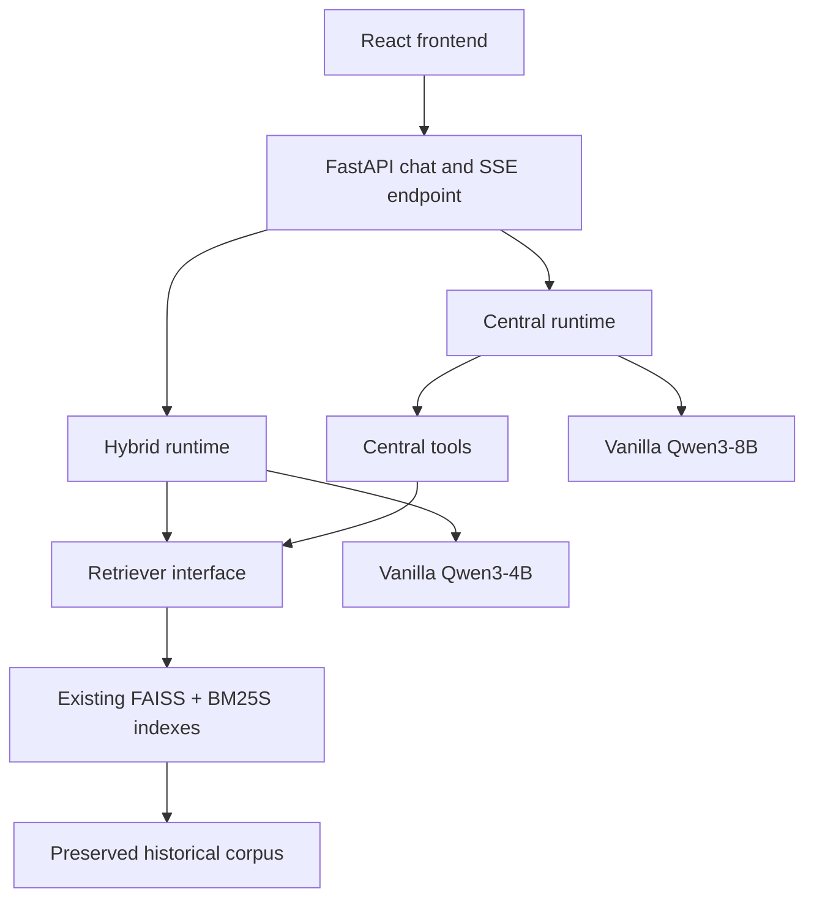

# Baseline architecture

The application answers Vietnamese history questions through two public modes. Both use the same historical corpus and retrieval subsystem. Models are loaded only for generation; retrieval can run on its own.

## Inference paths

| Mode | Execution | Model |
|---|---|---|
| `hybrid` | Retrieve history chunks, assemble a cited context prompt, stream the generated answer. | `Qwen/Qwen3-4B-Instruct-2507` |
| `central` | Gather local history evidence, run bounded tool calls when useful, then stream the final answer. | `Qwen/Qwen3-8B` |

Neither path needs a role adapter. The baseline defaults to `do_sample=false` and `enable_thinking=false`. Model IDs and optional revisions are explicit settings; benchmark metadata records the observed model and generation settings. A missing required model or retrieval artifact is an error rather than an implicit model change.

## Code boundaries

| Module | Responsibility |
|---|---|
| `app/api/routes.py` | Request validation, mode dispatch, SSE events, and disconnect handling. |
| `app/rag/hybrid_runtime.py` | Hybrid retrieval and final prompt construction. |
| `app/central/runtime.py` | Central tool loop and final prompt construction. |
| `app/rag/retriever.py` | Retrieval interface shared by both modes. |
| `app/rag/retrieval.py` | Baseline FAISS + BM25S retrieval implementation. |
| `app/models/qwen.py` | Vanilla Qwen model loading and token streaming. |
| `app/chat/` | Conversation persistence and uploaded document handling. |
| `app/telemetry.py` | Per-request timestamps and structured tracing. |
| `benchmarks/` and `evaluation/` | External measurements; production does not import them. |

Dependencies flow from API to mode runtimes to the retriever and model runtime. The retriever does not import an agent, and the model runtime does not know FAISS or BM25S details.

## Retrieval baseline

The existing retrieval algorithm remains the baseline: multilingual E5 embeddings and FAISS dense search; BM25S sparse search; weighted reciprocal-rank fusion; cross-encoder reranking; metadata signals, deduplication, and context diversity. Deterministic query expansion and domain checks can run before retrieval. Both modes call this implementation through the same retrieval interface. The corpus and indexes are read as existing artifacts and are never rebuilt when the server starts.

The original data locations are intentionally retained. See [`corpus_preservation_manifest.json`](corpus_preservation_manifest.json) for filenames, sizes, counts, and hashes captured before the refactor. The read-only `python -m scripts.corpus.audit_corpus` command checks those bytes against the manifest. Corpus building and indexing commands are explicit operations in `scripts/corpus/` and `scripts/retrieval/`; they are not part of application startup or an audit.

The retrieval interface permits a later Qdrant experiment without changing answer generation. Qdrant is not used in this baseline.

## Streaming and request lifecycle

The browser sends `POST /api/v1/chat/stream` with `conversation_id`, `question`, and `mode`. The server can send status events while it retrieves, prepares prompts, or runs Central tool rounds. The final generation emits actual model output as `answer_delta` events. The server then sends `sources` and `done`, or an `error` event on failure. The saved assistant answer must equal the concatenation of visible answer deltas.

Generation runs outside the async HTTP event loop. Cancellation and client disconnect set a stop signal checked by the model generation loop, and the request stops forwarding output. Central may complete internal tool rounds before final answer streaming begins. Consequently, Central answer TTFT includes that planning and tool time. A status event never counts as an answer token.

The API records request timestamps and spans; the external benchmark measures the HTTP/SSE exchange with a monotonic clock. [`BASELINE_BENCHMARK.md`](BASELINE_BENCHMARK.md) defines TTFB, first status, model TTFT, answer TTFT, end-to-end time, TPOT, inter-token latency, and throughput. Unobservable fields remain null.

## Evaluation and future experiments

The versioned question dataset supports unlabeled questions. Retrieval metrics use relevant chunk or source IDs when provided. Answer similarity uses a gold answer when provided. Grounding and citation checks are reported separately from answer similarity. Missing labels yield N/A. See [`EVALUATION.md`](EVALUATION.md).

Future changes should compare one variable at a time against this baseline, using the same corpus, questions, hardware, and measurement process. [`EXPERIMENTS.md`](EXPERIMENTS.md) provides the recording template. The first proposed experiment compares serving backends while keeping retrieval unchanged.
